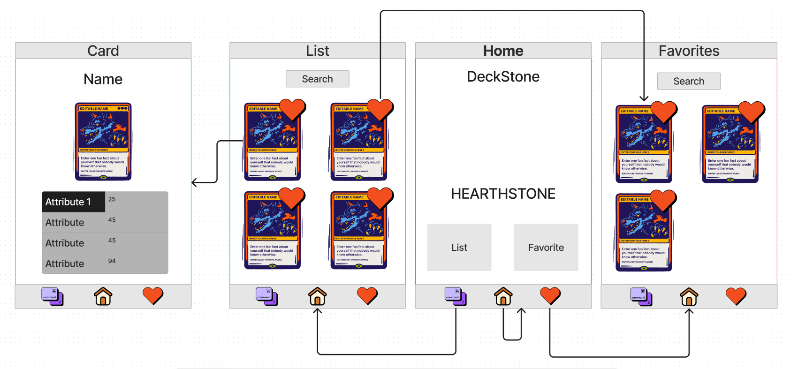

<div align = center>


</div>

<div align = center>

---

&nbsp; 
&nbsp; 


---

</div>

<div align = center>

# **DesckStone**

</div>


# :bookmark: Présentation

DeckStone est une application master detail créé grâce au framework React Native en TypeScript  et en JavaScript. 
Elle vous permet la gestion des cartes hearstone que vous posséder avec la consultation des informations des cartes et l'utilisation de favoris persistants. 


# Notation :white_check_mark:


## ``` Documentation ```

:white_check_mark: **ReadMe**  
:white_check_mark: **Sketches** : 

## ```Bases```

:white_check_mark: **Navigation** : Nous avons une barre de navigation fonctionnel nous permettant de naviguer entre les trois écrans.  
:white_check_mark: **Store** : Nous utilisons le store pour charger nos données et les stocker mais aussi pour gérer les favoris.  
:white_check_mark: **Actions** : Nous utilisons les actions pour charger les données depuis le redux mais aussi pour ajouter et supprimer les favoris.  
:white_check_mark: **Display List of Items** : Nous affichons la liste des cartes et celles des favoris dans 2 écrans différents.  
:white_check_mark: **Display image** : Chaque cartes sont affiché par un component qui affiche l'image de la carte.  
:white_check_mark: **Child props** : Nous utilisons un props pour passer la carte au component qui l'affiche.  
:white_check_mark: **TextInput** : Une recherche par nom peut être effectué par dans les 2 listes.  

## ```Application features```

:construction: **API** : Nous utilisons l'API officielle du jeu pour récupérer nos données, cependant nous n'avons pas pu gérer le changement de token, nous le changeons donc à la main.   
***Source*** : https://develop.battle.net/documentation/hearthstone/game-data-apis  
:white_check_mark: **Store favorite data into phone storage** : Nous utilison l'AsyncStorage pour sauvegarder la liste des favoris dans le téléphone.  
:construction: **Write Tests** : Nous testons les actions, le reducer et les composants UI que nous avons implémenter, cependant les éléments utilisant indirectement l'AsyncStorage ne passent pas les tests à cause d'un problème d'utilisation du mockAsyncStorage.  

## ``Bonus``

* :construction: **Dark/Light mode switch** : Nous n'avons mis en place cette gestion seulement dans la branche dédié par souci de visuel
* :construction: **Sexy UI** : A vous de juger ! 


# :construction: Développeurs

- Corentin RICHARD : corentin.richard@etu.uca.fr
- Pierre FERREIRA : pierre.ferreira@etu.uca.fr

<div align="center">
<a href = "https://codefirst.iut.uca.fr/git/corentin.richard">

</a>
<a href = "https://codefirst.iut.uca.fr/git/pierre.ferreira">

</a>

© IUT - Auvergne
</div>